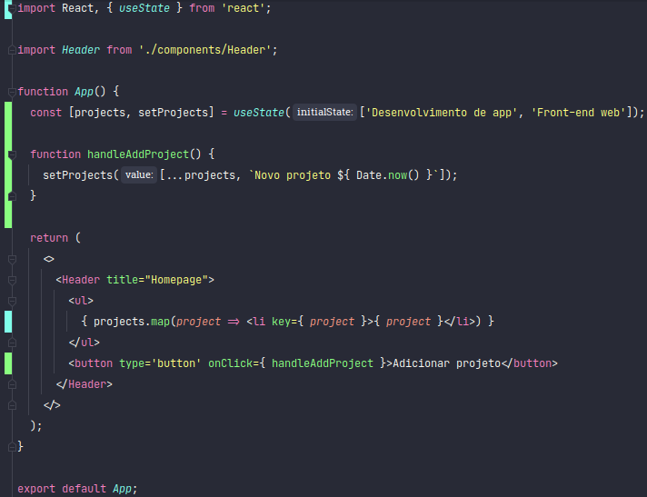
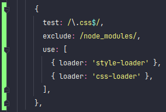
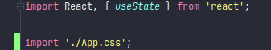
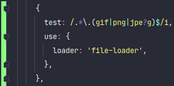
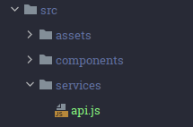
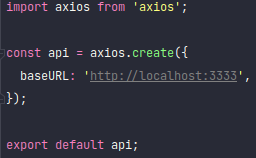

<h1 align="center">Fundamentos do ReactJS</h1>

## Transpilar

Mesmo os navegadores mais modernos não conseguem entender os sprints do React, por isso é necessário usar o **Babel**.
Ele é responsável por transpilar o código React de uma maneira que os navegadores entendam. E usando os loaders do
**Webpack**, será possível converter _JavaScripts_, _Imagens_ e _Estilos_ de acordo com o que os navegadores esperam.

---

## Componentes

Conjunto isolado de HTMLs e CSSs que podem ser reaproveitado em outros lugares.

### JSX

Os elementos que criamos no React são feitos utilizam do JSX para descrever como a UI deve parecer, com ele pode-se
utilizar HTML no JavaScript.

### Fragment

Com o Fragment, pode-se agrupar uma lista de componentes filhos sem a adição de nós extras dentro do DOM.

Utilizando componente com Fragment:

---

## Propriedades

São informações que podemos passar de um componente pai para um componente filho. As propriedades são passadas para um
componente num formato de atributo, eles são extraídos do parâmetro _pros_ que o componente recebe.

Como passar uma propriedade para componente:

Como pegar a propriedade no componente, já com desestruturação:

Por padrão todo componente em React pode receber um atributo chamado _children_.

Como passar:

Usando no componente:

---

## Estado e Imutabilidade

Com os **Estados** no React, podemos manipular as informações em tempo de execução e atualizá-las na tela do usuário. A
Função useState do React retorna um Array com 2 posições:

- Variável com os dados armazenados;
- Função para atualizar os valores;

A **imutabilidade** é utilizada para garantir o desempenho mesmo em aplicações que contenham muitos dados, isto consiste
em proibir a alteração do formato de uma variável, ou seja, não é permitida a inclusão ou exclusão direta dos dados.

---

## Importando CSS e imagens

### CSS

Assim como existem regras no webpack para arquivos JS, é necessário criar as regras para CSS.

- `css-loader`: Lê o arquivo css e interpreta as importações que existem dentro do arquivo;
- `style-loader`: Faça a estilização interpretada pelo _css-loader_ ser injetada no HTML.

Para usar o estilo, basta importar o CSS para o componente:

### Imagens

Para lidar com imagens também é necessário criar regras no webpack.

- `file-loader`: Interpretar imagens dentro dos componentes.

---

## Listando Projetos da API

### Axios

O Axios é usado para integrar o front-end com o back-end, tendo a responsabilidade de fazer as chamadas HTTP. Dentro da
pasta services colocamos todas as chamadas externas, exemplo a chama
a [API NodeJS](https://github.com/matheus-mf/api-gestao-projetos-nodejs).

Instância do Axios:

---

## Cadastrando Projetos
