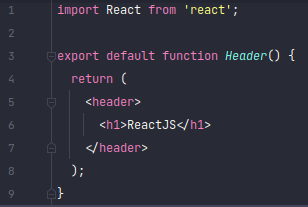
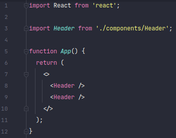
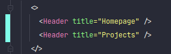
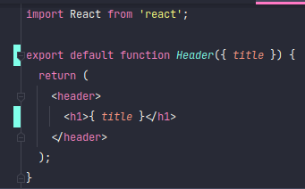
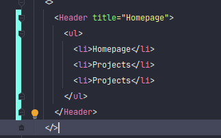
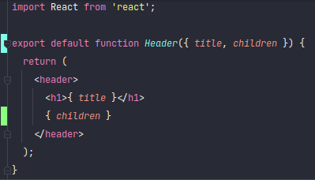

<h1 align="center">Fundamentos do ReactJS</h1>

## Transpilar

Mesmo os navegadores mais modernos não conseguem entender os sprints do React, por isso é necessário usar o **Babel**.
Ele é responsável por transpilar o código React de uma maneira que os navegadores entendam. E usando os loaders do
**Webpack**, será possível converter _JavaScripts_, _Imagens_ e _Estilos_ de acordo com o que os navegadores esperam.

---

## Componentes

Conjunto isolado de HTMLs e CSSs que podem ser reaproveitado em outros lugares.

### JSX

Os elementos que criamos no React são feitos utilizam do JSX para descrever como a UI deve parecer, com ele pode-se
utilizar HTML no JavaScript.

### Fragment

Com o Fragment, pode-se agrupar uma lista de componentes filhos sem a adição de nós extras dentro do DOM.

Utilizando componente com Fragment:

---

## Propriedades

São informações que podemos passar de um componente pai para um componente filho. As propriedades são passadas para um
componente num formato de atributo, eles são extraídos do parâmetro _pros_ que o componente recebe.

Como passar uma propriedade para componente:

Como pegar a propriedade no componente, já com desestruturação:

Por padrão todo componente em React pode receber um atributo chamado _children_.

Como passar:

Usando no componente:

---

## Estado e Imutabilidade

---

## Importando CSS e imagens

---

## Listando Projetos da API

---

## Cadastrando Projetos
